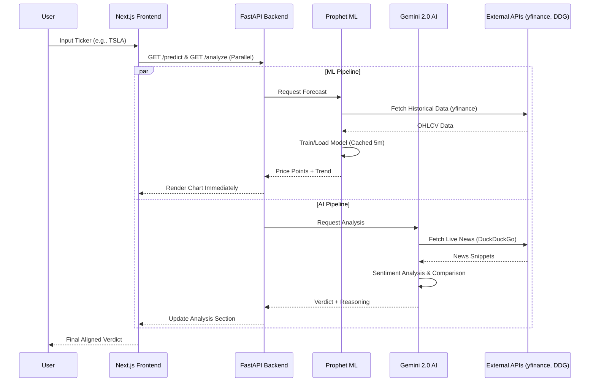

# Autonomous Financial Analyst 📈🤖

> **Disclaimer:** This is an educational tool for market analysis demonstration. It is NOT financial advice.

A high-performance hybrid system that bridges the gap between **Quantitative Forecasting** (Machine Learning) and **Qualitative Context** (Artificial Intelligence). The system predicts price trends using **Facebook Prophet** and validates them against real-time market sentiment using **Gemini 2.0 Flash**.

---

## 🏗️ System Architecture

### Full-Stack Data Flow
The system utilizes an asynchronous, parallel execution pattern to minimize latency and provide a responsive user experience.



---

## 🧠 Backend Engine (FastAPI)

The backend is built for speed and reliability, featuring a dual-layer intelligence architecture.

### 1. ML Forecasting Layer (`/predict`)
- **Engine:** Facebook Prophet 1.1.5.
- **Data Source:** `yfinance` (1-year historical lookback).
- **Caching:** Models are serialized to JSON in `app/storage/models/` with a **5-minute TTL** to ensure sub-2s response times for high-traffic tickers.
- **Logic:** Calculates a 30-day forecast, confidence bands, and trend direction (UP/DOWN/NEUTRAL).

### 2. Intelligence Layer (`/analyze`)
- **Engine:** Gemini 2.0 Flash via Google Generative AI.
- **Search:** `duckduckgo-search` for real-time news retrieval.
- **Sentiment Logic:** Analyzes news snippets to determine if sentiment is POSITIVE, NEGATIVE, or NEUTRAL.
- **Comparison Engine:** A rule-based comparator that maps ML trends + AI sentiment to a final verdict:
  - ✅ **ALIGNED**: Both ML and News agree on the direction.
  - ❌ **CONFLICTING**: ML predicts one way, but news suggests another.
  - ⚠️ **UNCERTAIN**: Missing data or neutral signals.

---

## 💻 Frontend Dashboard (Next.js)

A premium, responsive dashboard built with **Tailwind CSS** and **Chart.js**.

### Key Features
- **Parallel Orchestration:** Fires both API requests simultaneously. The chart renders as soon as the prediction arrives, while the analysis section continues to load independently.
- **Premium Design:**
    - Dark-mode "Deep Space" theme with glassmorphism effects.
    - SVG-based **Confidence Rings** for visual feedback.
    - Staggered **Fade-up Animations** for news articles.
- **Robust State Management:** 
    - Per-section loading spinners.
    - **AbortController** timeouts (10s) to prevent hanging requests.
    - Custom error mapping for 404s (Invalid Ticker), 422s, and 502s.

---

## 🚀 Deployment & Setup

### Prerequisites
- Docker & Docker Compose
- [Google Gemini API Key](https://aistudio.google.com/app/apikey)

### Local Installation

1. **Configure Environment:**
   Create a `backend/.env.local` file:
   ```env
   GEMINI_API_KEY=your_key_here
   ```

2. **Launch with Docker:**
   ```bash
   docker-compose up --build
   ```

3. **Access:**
   - **Frontend:** [http://localhost:3000](http://localhost:3000)
   - **API Docs:** [http://localhost:8000/docs](http://localhost:8000/docs)
   - **Health Check:** [http://localhost:8000/health](http://localhost:8000/health)

---

## 🛠️ Tech Stack
- **Backend:** Python 3.10, FastAPI, Prophet, yfinance, Gemini Pro.
- **Frontend:** Next.js 14, TypeScript, Tailwind CSS, Chart.js.
- **Ops:** Docker Compose, Health Checks, JSON-based persistence.

---

## 📂 Project Structure
```text
autonomous-financial-analyst/
├── backend/
│   ├── app/
│   │   ├── routes/      # FastAPI endpoints (/predict, /analyze)
│   │   ├── utils/       # Core Logic (Prophet, Gemini, News)
│   │   ├── models/      # Pydantic Schemas
│   │   └── storage/     # Model Cache Directory
│   ├── main.py          # Entry point & CORS Config
│   └── Dockerfile
├── frontend/
│   ├── app/             # Next.js App Router (Layout, Page, Components)
│   ├── utils/           # API Client (AbortController, Error Mapping)
│   └── Dockerfile
└── docker-compose.yml   # Multi-container orchestration
```
