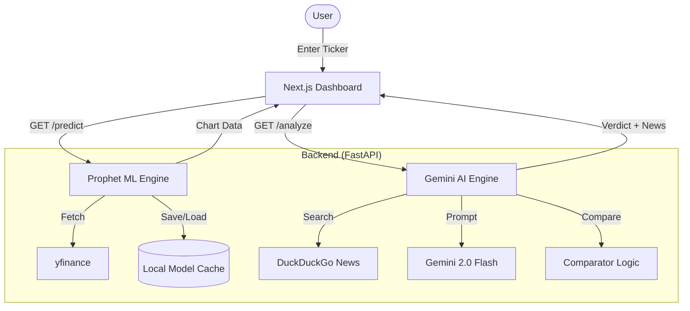

# Autonomous Financial Analyst 📈🤖

> **Disclaimer:** Educational tool only. Not financial advice.

A hybrid ML + LLM system that combines time-series price prediction (**Prophet**) with LLM-powered news validation (**Gemini**) to determine if a stock/crypto forecast aligns with current market sentiment.

---

## 🏗️ System Architecture

### High-Level Data Flow


### Components
- **Backend:** FastAPI, Prophet (ML), Gemini (LLM), yfinance (Data)
- **Frontend:** Next.js 14, React, Tailwind, Chart.js
- **Containerization:** Docker & Docker Compose
- **Persistence:** Local JSON caching for trained models

---

## 🚀 Getting Started (Local Development)

### Prerequisites
- Docker Desktop installed and running
- A Google Gemini API key

### Setup

1. **Clone the repo and configure environment:**
   ```bash
   cp .env.example backend/.env.local
   # Edit backend/.env.local and add your GEMINI_API_KEY
   ```

2. **Run with Docker Compose:**
   ```bash
   docker-compose up --build
   ```

3. **Verify:**
   - **Backend health:** [http://localhost:8000/health](http://localhost:8000/health)
   - **API Docs (Swagger):** [http://localhost:8000/docs](http://localhost:8000/docs)
   - **Frontend:** [http://localhost:3000](http://localhost:3000)

---

## 📡 API Endpoints

### 1. Predict (`GET /predict`)
Returns a 30-day forecast including confidence intervals and model performance metrics.
- **Cache TTL:** 5 Minutes
- **Target Latency:** < 2 Seconds

### 2. Analyze (`GET /analyze`)
Retrieves news and performs AI alignment analysis.
- **Verdict Types:** `ALIGNED`, `CONFLICTING`, `UNCERTAIN`
- **Graceful Degradation:** Defaults to `UNCERTAIN` if LLM/Search fails.

---

## 📂 Project Structure
```text
autonomous-financial-analyst/
├── backend/
│   ├── app/
│   │   ├── routes/      # FastAPI endpoints
│   │   ├── utils/       # ML & LLM Logic
│   │   ├── models/      # Pydantic schemas
│   │   └── storage/     # Cached models (.json)
│   ├── main.py
│   └── Dockerfile
├── frontend/
│   ├── app/             # Next.js App Router
│   └── Dockerfile
└── docker-compose.yml
```

---

## 🛠️ Tech Stack Refinement
- **Prophet 1.1.5**: Pinned for stability with `cmdstanpy<1.2`.
- **Gemini 2.0 Flash**: Optimized for sub-4s reasoning.
- **Next.js 14**: Utilizing App Router for modern frontend performance.
